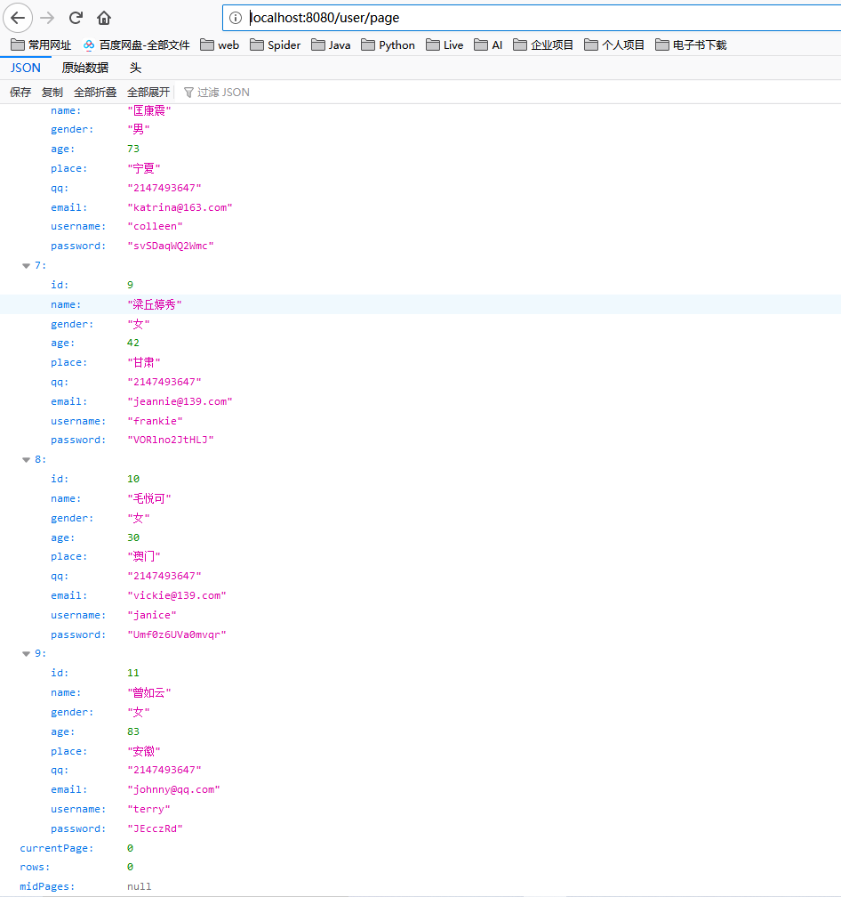
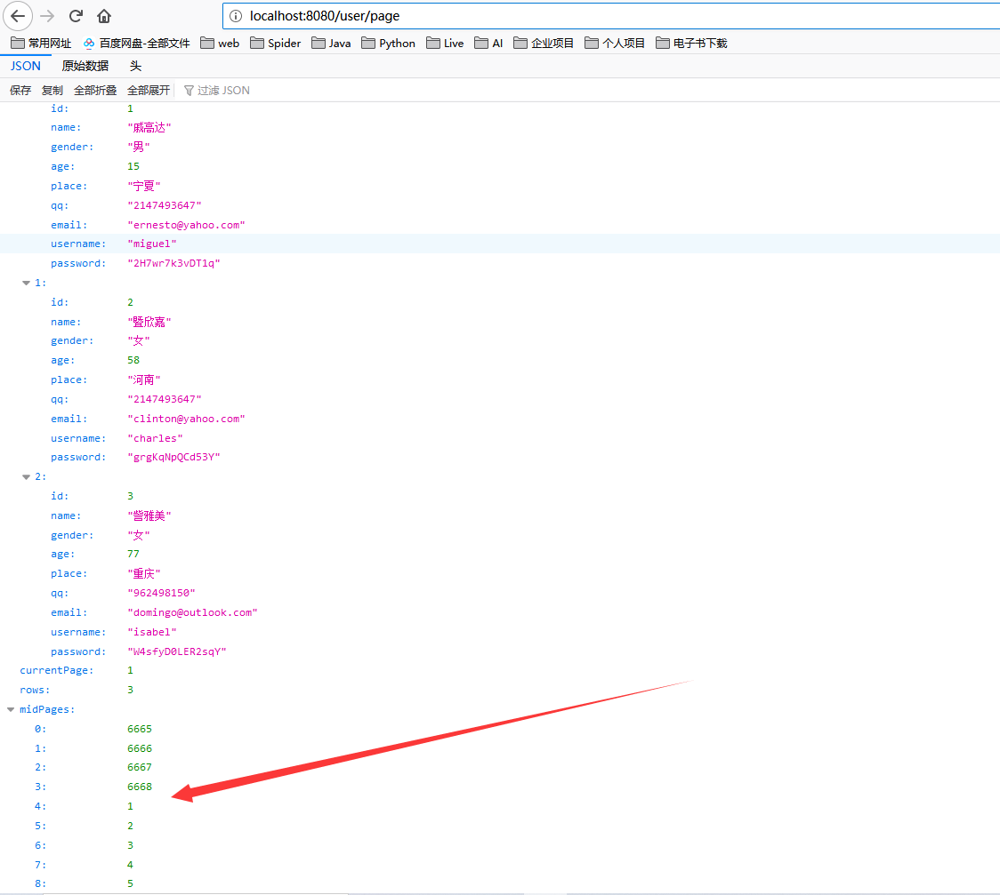

# 理想国SSM分页器


>   作者: 张大鹏
>
>   版权: 归张大鹏个人所有,侵权必究
>
>   报名: 欢迎联系我学习Python,Java,C#,PHP,GO等编程
>
>   微信: 18010070052
>
>   抖音: lxgzhw
>
>   GitHub地址: https://github.com/lxgzhw520


## 使用方法

1.核心源码是LxgPage和同文件夹的ben/Page


2.调用方法,请参考下面的代码

```java
@Override
public Page<User> page(int currentPage, int rows) {
  List<User> users = userDao.findByLimit((currentPage - 1) * rows, rows);
  long count = userDao.findCount();
  //闯入当前页,每页数量,当前页的数据,总数量
  return LxgPage.page(currentPage, rows, users, count);
}
```


3.整个项目是我封装好的SSM项目,基于Maven的Web项目

-   如果大家不会搭建SSM框架
-   下载源码导入IDEA即可


## 下面是实现过程

#### 封装一个LxgPage类,能够实现分页功能


1.创建一个SSM项目


2.确保能够正常访问


3.要实现分页功能,我是这样的想的

-   1.首先,所谓的分页,本质上是要返回一个分页对象,所以需要先构造一个分页对象
-   2.然后,关键的是在service中填充分页对象,并返回


4.先构造一个分页对象

```java
public class Page<T> {
    private long totalCount;//总记录数
    private long totalPage;//总页码
    private List<T> list;//每页的数据
    private int currentPage;//当前页码
    private int rows;//每页显示的记录数
    private long[] midPages;//中间页码
}
```


5.定义一个返回分页对象的方法,先默认查询所有的对象

```java
@Override
public Page<User> page() {
  Page<User> userPage = new Page<>();
  List<User> users = userDao.findAll();
  userPage.setList(users);
  return userPage;
}
```


6.添加控制器方法

```java
@ResponseBody
@RequestMapping("/page")
public Page<User> page() {
  Page<User> page = userService.page();
  return page;
}
```


7.重启服务器,访问该路由测试,查看是否能获取到数据

-   这里,原来的路由没问题,一下子返回两万条数据


-   我继续测试分页路由
-   然后,我发现分页路由也没有问题,做软件果然需要耐心,昨天写了一天都没搞定,一早上起来就搞定了


8.上面的成功了以后,就可以继续优化了,首先,我们要写一个dao方法,是进行分页查询的

```java
@Select("select *from user limit #{currentPage},#{rows}")
List<User> findByLimit(@Param("currentPage") int currentPage, @Param("rows") int rows);
```


9.然后我们要步步为营,小心的修改service方法

```java
@Override
public Page<User> page() {
  Page<User> userPage = new Page<>();
  // List<User> users = userDao.findAll();
  //将数据修改为根据分页查询
  List<User> users = userDao.findByLimit(1, 10);
  userPage.setList(users);
  return userPage;
}
```


10.先不急着写其他代码,我们重启服务器,重新访问分页路由,确认真的只拿到了:"注意,这里实际上只有9条数据,因为我们没有对页码做处理"

-   有点激动,通过一番修改和测试,真的成功了,离成功又近了一步
-   截图如下




11.如果以上步骤都没问题了,接下来,我们先对分页做处理

-   修改service,我们的目标是从控制器拿到当前页和每页数量,所以添加参数

```java
@Override
public Page<User> page(int currentPage, int rows) {
  Page<User> userPage = new Page<>();
  // List<User> users = userDao.findAll();
  //对参数做处理
  //这里要记住分页查询公式   limit (currentPage-1)*rows,rows
  //将数据修改为根据分页查询
  List<User> users = userDao.findByLimit((currentPage - 1) * rows, rows);
  userPage.setList(users);
  return userPage;
}
```

-   修改了方法,我们不得不对控制器做修改了,修改控制器

```java
@ResponseBody
@RequestMapping("/page")
public Page<User> page() {
  //查询第1页,每页3条数据
  Page<User> page = userService.page(1, 3);
  return page;
}
```

-   到了这一步,记得要有耐心,重启服务器,进行调试,确保这一步也没问题

-   我重启了服务器,真的没问题,感觉很酷


12.接下来,我们还要继续优化,设置下一个比较关键的参数,那就是数据总量

-   先定义一个dao方法,能够查询数据总量

```java
@Select("select count(*) from user")
long findCount();
```

-   接着,修改service方法,将数据总量查询出来,并通过数据总量和每页数量计算总页数,将数据总量和总页数设置到分页器中

```java
@Override
public Page<User> page(int currentPage, int rows) {
  Page<User> userPage = new Page<>();
  // List<User> users = userDao.findAll();
  //对参数做处理
  //这里要记住分页查询公式   limit (currentPage-1)*rows,rows
  //将数据修改为根据分页查询
  List<User> users = userDao.findByLimit((currentPage - 1) * rows, rows);
  userPage.setList(users);

  //接下来,计算数据总量和总页数
  long count = userDao.findCount();//数据总量
  long totalPage = count % rows == 0 ? count / rows : count / rows + 1;//总页数
  userPage.setCurrentPage(currentPage);
  userPage.setRows(rows);
  userPage.setTotalCount(count);
  userPage.setTotalPage(totalPage);

  return userPage;
}
```

-   接下来,还是要有耐心,重启服务器,查看,是否设置的分页数据都能够拿到
-   通过测试发现,真的没问题,实在是太好了,如果对中间页码每页要求的话,分页器基本就这样写好了


13.接下来,我还要继续封装中间页码

-   为什么封装中间页码,是为了减轻前端的压力
-   现在很多前端框架都自己封装了分页功能,所以这个可有可无
-   但是,为了更普适,咱们还是继续封装
-   修改service代码

```java
@Override
public Page<User> page(int currentPage, int rows) {
  Page<User> userPage = new Page<>();
  // List<User> users = userDao.findAll();
  //对参数做处理
  //这里要记住分页查询公式   limit (currentPage-1)*rows,rows
  //将数据修改为根据分页查询
  List<User> users = userDao.findByLimit((currentPage - 1) * rows, rows);
  userPage.setList(users);

  //接下来,计算数据总量和总页数
  long count = userDao.findCount();//数据总量
  long totalPage = count % rows == 0 ? count / rows : count / rows + 1;//总页数
  userPage.setCurrentPage(currentPage);
  userPage.setRows(rows);
  userPage.setTotalCount(count);
  userPage.setTotalPage(totalPage);

  //最后一步,封装中间页码
  int index = 0;//计数器,记录数组的索引
  long[] midPages = new long[9];//中间页码数组
  for (long i = currentPage - 4; i < currentPage + 5; i++) {
    long value = i;
    //6: 1 2 3 4 5 6 7 8 9
    //如果i小于1,让i = 总页码 + 1
    //比如说 0 就是总页码  1就是总页码-1
    if (i < 1) {
      value = totalPage + i;
    }
    //如果i大于总页码 让i = i - 总页码
    //比如说总页数100   101 = 101 - 100 就等于1了
    if (i > totalPage) {
      value = i - totalPage;
    }
    //将每一个i都装进中间页码数组中
    midPages[index] = value;
    index++;
  }
  //将中间页码设置进Page对象
  userPage.setMidPages(midPages);

  return userPage;
}
```

-   重启服务器,查看中间页是否也获取了
-   没毛病,大功告成




14.代码已经实现了,接下来,我们就要抽取代码,封装为一个公共的工具类方法了

-   下面的代码比较个性化,自行封装即可
-   这里,我只展示我是怎么封装的
-   封装的方法

```java
public static <T> Page<T> page(int currentPage, int rows, List<T> users, long count) {
  Page<T> userPage = new Page<>();
  // List<User> users = userDao.findAll();
  //对参数做处理
  //这里要记住分页查询公式   limit (currentPage-1)*rows,rows
  //将数据修改为根据分页查询
  userPage.setList(users);

  //接下来,计算数据总量和总页数
  long totalPage = count % rows == 0 ? count / rows : count / rows + 1;//总页数
  userPage.setCurrentPage(currentPage);
  userPage.setRows(rows);
  userPage.setTotalCount(count);
  userPage.setTotalPage(totalPage);

  //最后一步,封装中间页码
  int index = 0;//计数器,记录数组的索引
  long[] midPages = new long[9];//中间页码数组
  for (long i = currentPage - 4; i < currentPage + 5; i++) {
    long value = i;
    //6: 1 2 3 4 5 6 7 8 9
    //如果i小于1,让i = 总页码 + 1
    //比如说 0 就是总页码  1就是总页码-1
    if (i < 1) {
      value = totalPage + i;
    }
    //如果i大于总页码 让i = i - 总页码
    //比如说总页数100   101 = 101 - 100 就等于1了
    if (i > totalPage) {
      value = i - totalPage;
    }
    //将每一个i都装进中间页码数组中
    midPages[index] = value;
    index++;
  }
  //将中间页码设置进Page对象
  userPage.setMidPages(midPages);

  return userPage;
}
```

-   如何调用
    -   可以看到,封装以后,只需要三行代码就可以实现分页功能了
    -   会返回一个分页对象,包含以下数据
        -   当前页
        -   每页数量
        -   当前页的数据集合
        -   轮盘式的中间页码
        -   数据总数
        -   总页数

```java
@Override
public Page<User> page(int currentPage, int rows) {
  List<User> users = userDao.findByLimit((currentPage - 1) * rows, rows);
  long count = userDao.findCount();
  //闯入当前页,每页数量,当前页的数据,总数量
  return LxgPage.page(currentPage, rows, users, count);
}
```

-   效果展示


